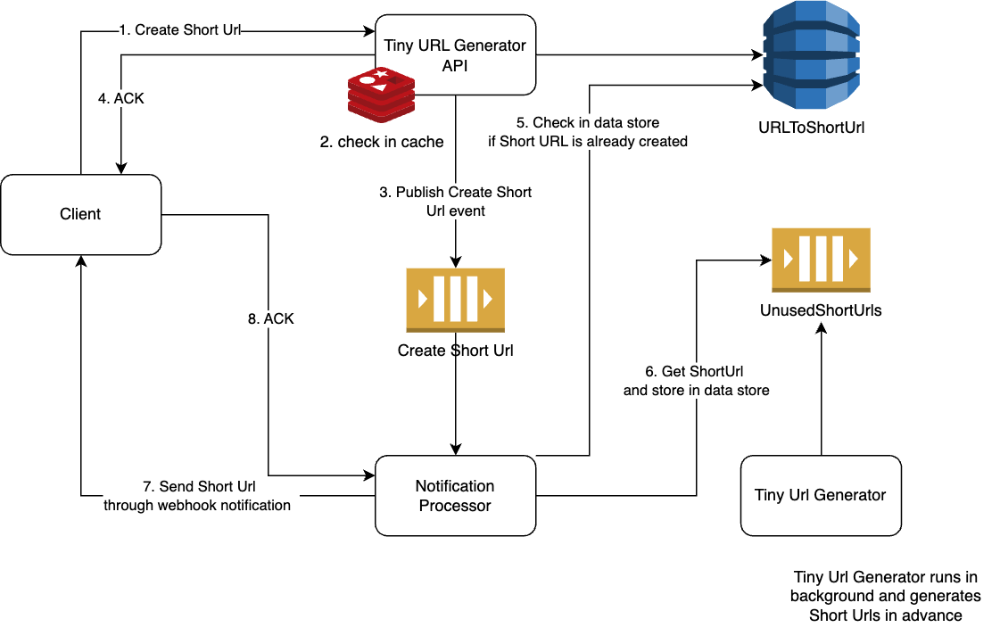

## Description
Tiny Url Generator app using [Nest](https://github.com/nestjs/nest) framework TypeScript starter repository.



## Docker Compose

```bash
$ docker-compose up --build
```

## Running the app Locally
## Installation

```bash
$ npm install
```

```bash
# development
$ npm run start

# watch mode
$ npm run start:dev

# production mode
$ npm run start:prod
```

## Test

```bash
# unit tests
$ npm run test

# e2e tests
$ npm run test:e2e

# test coverage
$ npm run test:cov
```
